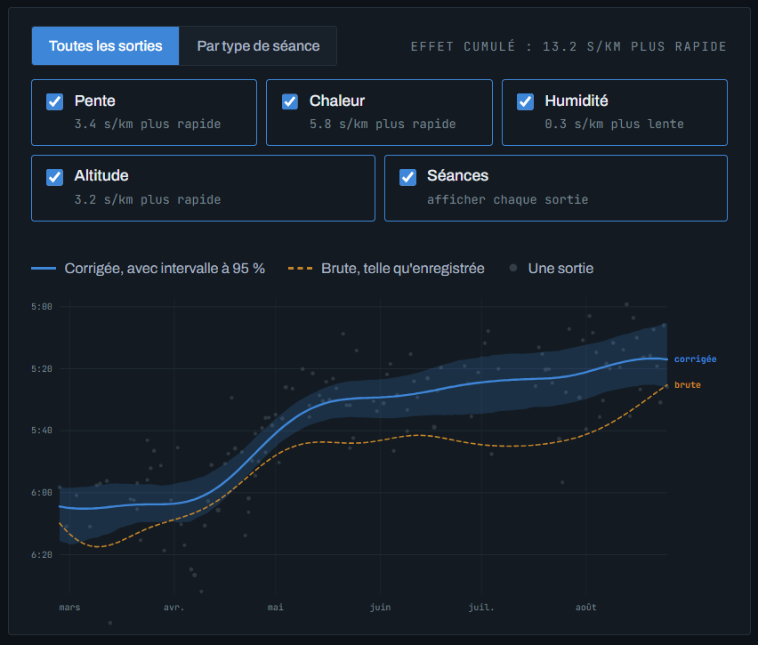

**English** · [Français](README.fr.md)

# coros-perf

A [Claude Code](https://claude.com/claude-code) skill that turns months of COROS
running data into a performance curve **corrected for conditions**: gradient,
heat, humidity, altitude.

Because a 10 km run at 32 °C is not the same run at 8 °C, and an easy jog at
1000 m in the mountains is not an easy jog by the sea.



## The problem

Training runs are not maximal tests. Raw pace mostly reflects how hard you chose
to go that day — not your fitness. And even at constant effort, weather and
terrain move your pace by several percent.

So a raw pace curve mixes three things at once: your progression, the day's
intensity, and the conditions. There is no way to tell which one is moving.

## What the skill does

It expresses every run as **the pace you would have held at a reference heart
rate, in continuous effort, under neutral conditions**, then builds a
self-contained interactive page:

- a raw curve and a corrected curve, with a confidence band;
- one checkbox per factor, so you can see what each one costs you;
- a toggle between all runs and a breakdown by session type (continuous vs
  intervals);
- per-run detail on hover — weather, altitude, WBGT.

The corrections come from published research, **not** from fitting your own
data. Over six months heat is confounded with season, which is itself confounded
with your progression, so the coefficients simply aren't identifiable from your
runs alone. The band you see is a Monte-Carlo simulation over the plausible
ranges of those published coefficients, combined with a bootstrap over sessions.

| Factor | Source | Typical magnitude |
|---|---|---|
| Gradient | COROS *Adjusted Pace*, after Minetti et al. (2002) | up to +16 % in the mountains |
| Heat + humidity | WBGT — Stull (2011), Hunter & Minyard (1999), ISO 7243; degradation after Ely et al. (2007) | +2 % median, +6 % in a heatwave |
| Altitude | Wehrlin & Hallén (2006), attenuated for submaximal effort and acclimatisation | +1 % median, +4 % at 1200 m |

Full details in [`references/methode.md`](references/methode.md) (in French).

## Requirements

**A COROS MCP connector** wired to your account. This is the real barrier —
without it the extraction step produces nothing. The skill checks for it first.

**Python with numpy and pandas.** `node` is not needed.

**Your true resting and maximum heart rate.** The whole index shifts if they are
wrong, and nothing will warn you.

## Installation

Copy the skill itself into your personal skills — only `SKILL.md`, `scripts/`,
`references/` and `assets/` are part of it; the rest of this repo is
documentation:

```bash
git clone https://github.com/MaximeBedoin/coros-perf-skill.git
mkdir -p ~/.claude/skills/coros-perf
cd coros-perf-skill && cp -r SKILL.md scripts references assets ~/.claude/skills/coros-perf/
```

Or install the [`dist/coros-perf.skill`](dist/coros-perf.skill) bundle from
Claude Code, which contains exactly those files.

For a team, drop the folder into `.claude/skills/` in a repository and the skill
becomes available to everyone working in it.

## Usage

Once installed, just ask:

> analyse my running progression over the last 6 months

The description is written to fire on indirect phrasings too — "my form", "am I
actually improving or is it just the weather". Or invoke it explicitly with
`/coros-perf`.

The skill is written in French, and so is the page template. That is not a
barrier: ask for the page in English and Claude will translate it as it builds —
about 550 words and 20 strings, most of it prose in the "Method" panel. The
[skill file](SKILL.md) lists the three spots worth checking afterwards (month
names, the faster/slower wording, decimal separators).

## Bonus: race-day target pace

The same model run backwards. Instead of pulling an observed run towards neutral
conditions, it projects a reference pace onto the conditions of a given place,
date and **time of day**:

```bash
cd scripts && python pace_target.py --pace 4:25 --distance 10 \
    --place "Paris" --datetime "2027-07-15 14:00" --scan 7-21
```

```
Allure de référence   4:25 /km
Allure à viser        4:34 /km   (80 % : 4:30 à 4:42)
Écart                 9 s/km plus lent   ·   1.5 min sur 10 km

Selon l'heure de départ :
   7 h     16 °C   WBGT 14.8   4:29 /km  =======  <-- meilleur
  14 h     24 °C   WBGT 20.8   4:35 /km  ===================
```

Within 16 days it uses the forecast; beyond that, the climatology of the same
calendar day over ten years, which yields a range rather than a single number.
`--scan` compares start times — worth 6 s/km on a July 10 km in Paris.
`--elevation-gain` applies the Minetti cost of gradient to the course profile.

---

# Build one yourself

The interesting part isn't this particular skill, it's the method for making
one. Here is how this one came about, with the actual steps.

## 1. Ask for a round of thinking before any code

The opening prompt was roughly:

> I'd like a performance curve over the last 6 months, accounting for heat,
> humidity and altitude, using estimates derived from the scientific literature.
> **Let's have a round of thinking first, and then you can start coding.**

That last sentence changes everything. Without it, Claude produces code
immediately and you discover the bad decisions far too late. With it, it first
explores your actual data and comes back with what's missing — here: COROS
stores neither temperature nor humidity, so an external weather source is
needed, which means sending your GPS coordinates to a third party.

It's also when the real questions surface. The one that mattered: *what exactly
are we measuring?* Raw pace means nothing across runs done at whatever effort
you felt like.

## 2. Let it hit the data

Several bugs only showed up by looking at intermediate results:

- a weather interpolation returning 17–23 °C from February to August — plausible
  at a glance, absurd on inspection;
- a curve ending at 4:00/km for a runner whose threshold is 4:25;
- easy runs coming out *faster* than tempo runs.

None raised an exception. All produced credible numbers. Hence the rule: **ask
to see the intermediate values**, not just the final chart. "Show me the
temperature range you fetched" caught the first bug in ten seconds.

## 3. Ask a question that breaks the model

The follow-up request was:

> break it down by session type

It exposed a real flaw: the intensity correction was biased by an omitted
variable. Estimated across all sessions the slope was −0.17; estimated properly,
with anaerobic load as a covariate, −0.95. A textbook case of Simpson's paradox,
invisible until you stratify.

Useful corollary: **a good follow-up question beats a code review.** Ask for a
breakdown, a comparison, an edge case — that's where the flaws surface.

## 4. Accept it when the data says no

Three session-type splits were tried. Two were rejected:

- **by intensity** — average heart rate drops as you get fitter, so sessions
  migrate between groups and a group changes definition mid-period;
- **by duration** — the runs were too uniform (39 ± 10 min) for a "long run"
  group to hold.

Two types remain instead of three. That's the right outcome: a distinction that
holds beats a decorative third category.

## 5. Freeze it with `/skill-creator`

Once the analysis was sound:

> let's make a Claude skill so we can do this on demand

Claude Code ships a `skill-creator` skill that structures the work: `SKILL.md`
for the procedure, `scripts/` for the code, `references/` for what shouldn't be
reloaded into context every time.

## What makes a skill better than a prompt

**Encode the traps, not the code.** Code regenerates. What doesn't is knowing
that `astype("int64")` on a `datetime64[us]` yields microseconds and that
`np.interp` silently returns the boundary value.
[`references/pieges.md`](references/pieges.md) lists eight such mistakes,
**indexed by symptom** — because none of them throws: you recognise them by the
odd result, never by an error message.

**Add executable guardrails.** A `check_data.py` that rejects a duration typed in
minutes beats a paragraph telling you to be careful. The model also warns when a
coefficient takes a value that betrays the omitted-variable bug.

**Don't hard-code what can be computed.** The reference heart rate used to be
pinned at 145 bpm; it is now computed as the centre of gravity of the sessions,
so the skill makes the right call on any dataset.

**Write down what the model cannot tell you.** `methode.md` ends with a list of
out-of-reach questions — runner profile, race-time prediction, the fatigue
component. It stops you over-reading a pretty curve.

---

## Known limitations

- Intensity and anaerobic load correlate at ~0.84: both coefficients are
  significant but poorly separated individually.
- Altitude trips often coincide with summer, so altitude and heat corrections
  stack exactly where they are least verifiable.
- Altitude is taken as the start elevation plus half the elevation gain.
- The Hunter & Minyard regression assumes moderate wind; wind is fetched but
  barely used.
- Transcribing MCP responses into CSV is manual — the fragile link, hence
  `check_data.py`.

## Privacy

The skill sends **GPS coordinates and timestamps** to
[Open-Meteo](https://open-meteo.com/) to reconstruct the weather. A run's start
coordinates usually reveal a home address. The skill asks for consent first.

No personal data is included in this repository: the sample CSV rows are
fictional.

## License

MIT — see [LICENSE](LICENSE).

The physiological models come from the cited publications; this repository
redistributes only their coefficients, along with the references needed to check
them.
